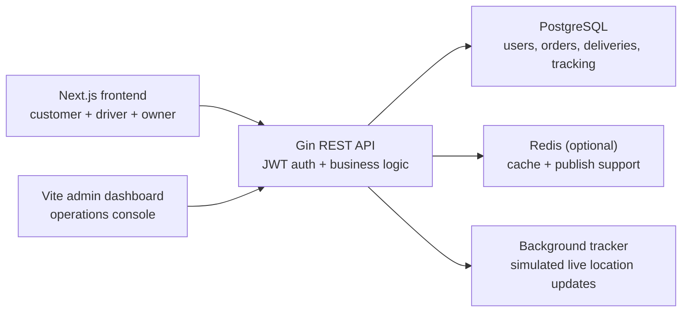

# jo3an

Premium food delivery platform with customer, driver, and admin experiences.

> Status: This project is still under active development.

jo3an is a full-stack Uber Eats style project built to feel like a real product, not just a CRUD demo. The frontend focuses on polished restaurant discovery, fast checkout, and clear order tracking, while the backend handles authentication, delivery lifecycle management, notifications, admin metrics, and simulated live tracking.

This workspace is split into three apps:

- `delivery-frontend`: Next.js 14 app for customers, drivers, and restaurant owners
- `delivery-admin`: Vite React admin dashboard for operations, dispatch, support, finance, and analytics
- `delivery-backend`: Go API built with Gin, GORM, and PostgreSQL

## What The Project Includes

### Customer experience

- Editorial restaurant discovery with featured collections and category browsing
- Menu browsing, cart management, and checkout flow
- Order history with active tracking and reorder paths
- JWT-backed sign-up, sign-in, and session-aware account flows

### Driver experience

- Dedicated driver workspace
- List of available deliveries
- Delivery acceptance and status progression
- Assigned delivery view with route progress

### Admin experience

- Standalone operations dashboard with overview, dispatch, orders, stores, couriers, customers, support, finance, promotions, analytics, and settings modules
- Uses backend admin auth, deliveries, drivers, activity logs, and notifications instead of seeded mock data
- Admin-role redirects from the customer app to the standalone dashboard during local development

### Backend capabilities

- Role-based access control for `customer`, `driver`, and `admin`
- Delivery quoting from pickup and drop-off addresses
- PostgreSQL persistence for users, deliveries, tracking points, status history, orders, and notifications
- Optional Redis-backed caching with in-memory fallback
- Background tracking updates for active deliveries
- Automatic schema migration on startup

## Architecture



## Stack

| Layer | Tools |
| --- | --- |
| Frontend | Next.js 14, React 18, TypeScript, Tailwind CSS, Zustand, Framer Motion |
| Admin | Vite, React 18, TypeScript, Tailwind CSS, TanStack Query, TanStack Table, Recharts, Zustand |
| Backend | Go 1.25.6, Gin, GORM |
| Database | PostgreSQL |
| Cache | Redis optional, in-memory fallback available |

## Project Structure

```text
.
├── delivery-backend
│   ├── cmd/api
│   ├── internal/handlers
│   ├── internal/services
│   ├── internal/models
│   └── internal/routes
├── delivery-frontend
│   ├── src/app
│   ├── src/components
│   ├── src/services
│   └── src/store
└── delivery-admin
    ├── src/app
    ├── src/components
    ├── src/services
    └── src/store
```

## Quick Start

### 1. Start the backend

Create `delivery-backend/.env`:

```dotenv
PORT=8080

DB_HOST=localhost
DB_PORT=5432
DB_USER=postgres
DB_PASSWORD=postgres
DB_NAME=delivery_backend
DB_SSLMODE=disable
DB_TIMEZONE=UTC

JWT_SECRET=change-this-in-production
JWT_EXPIRATION_HOURS=24

CACHE_TTL_SECONDS=20
TRACKING_TICK_SECONDS=8
RATE_LIMIT_REQUESTS=120
RATE_LIMIT_WINDOW_SECONDS=60

# Optional Redis
REDIS_ADDR=localhost:6379
REDIS_PASSWORD=
REDIS_DB=0
```

`DATABASE_URL` is also supported and overrides the `DB_*` settings.

Run the API:

```bash
cd delivery-backend
go run ./cmd/api
```

The backend auto-migrates the schema and starts on `http://localhost:8080`.

### 2. Start the frontend

Create `delivery-frontend/.env.local`:

```dotenv
NEXT_PUBLIC_API_BASE_URL=http://localhost:8080/api/v1
NEXT_PUBLIC_USE_MOCK_API=false
NEXT_PUBLIC_ADMIN_APP_URL=http://localhost:5173
```

Run the app:

```bash
cd delivery-frontend
npm install
npm run dev
```

Frontend default URL: `http://localhost:3000`

If you want to work on UI only, set `NEXT_PUBLIC_USE_MOCK_API=true`.

### 3. Start the admin dashboard

Create `delivery-admin/.env.local`:

```dotenv
VITE_APP_NAME=Eats
VITE_API_BASE_URL=http://localhost:8080/api/v1
VITE_FRONTEND_URL=http://localhost:3000
```

Run the admin app:

```bash
cd delivery-admin
npm install
npm run dev
```

Admin default URL: `http://localhost:5173`

The root development command starts the backend, frontend, and admin dashboard together:

```bash
npm run dev
```

## Development Commands

Backend:

```bash
cd delivery-backend
go test ./...
```

Frontend:

```bash
cd delivery-frontend
npm run lint
npm run build
```

Admin:

```bash
cd delivery-admin
npm run build
```

## Notes

- Restaurant data is currently mocked in code from `delivery-backend/internal/services/catalog.go`.
- Delivery tracking is simulated from address-derived coordinates and updated by a background ticker.
- Redis is optional. If it is missing or unavailable, the backend continues with in-memory caching.
- The frontend metadata and product copy refer to the experience as `jo3an`.
